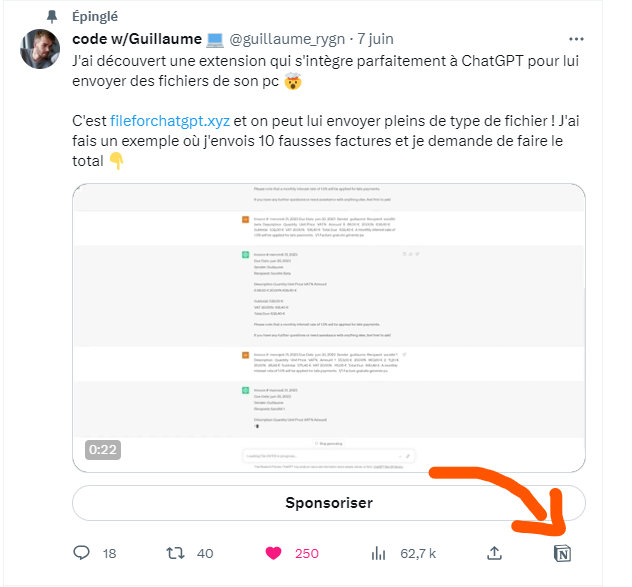
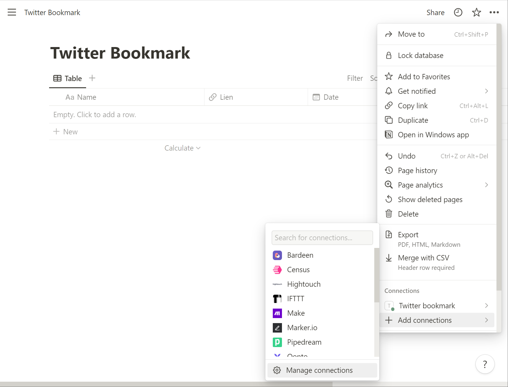
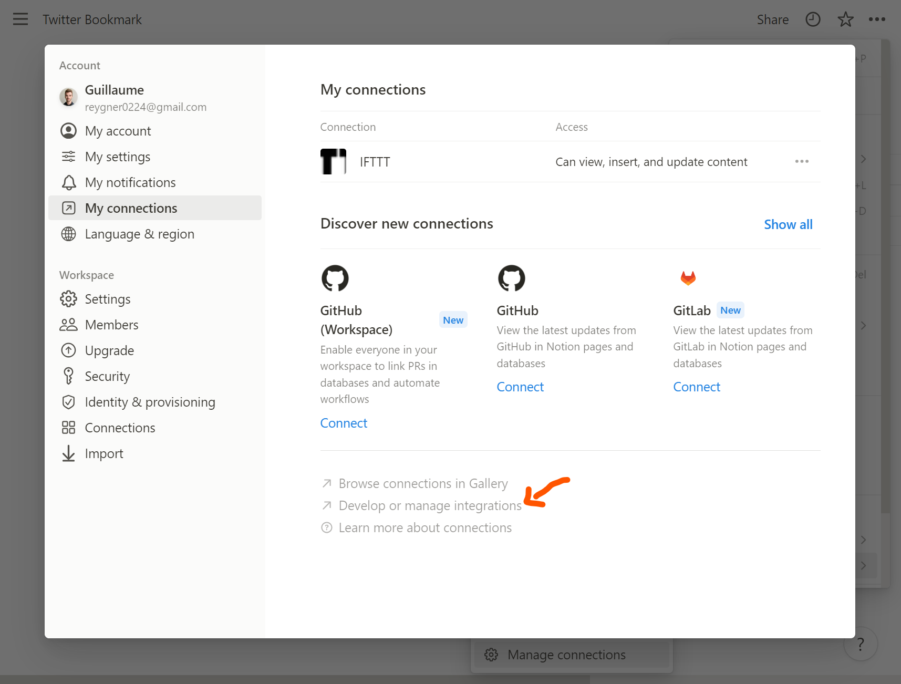
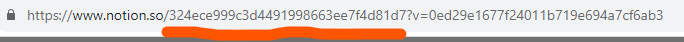
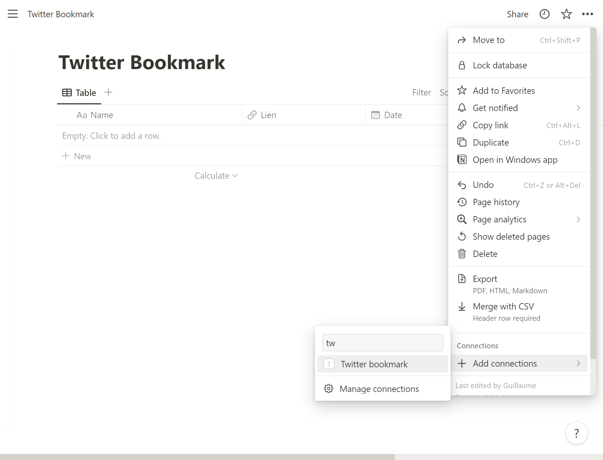

# Twitter to Notion 🐦



## ***It has never been so easy to save Tweet on Notion !***
&nbsp;

## Installation

Downalod and change the JS file background.js for add your credentials
```javascript
const NOTION_API_TOKEN = //add your Notion API Key here
const DATABASE_ID = //add your Notion Database_ID here
```
Go on your settings page menu, click on "Add connections" then click on "Manage connections"

&nbsp;
Click on "My Connections" menu and click on "Develop or manage integrations"

&nbsp;
Click on "New integration" give a name and click on "Submit". Now you have yout Notion API Key
&nbsp;
For the Notion Database_ID go to your notion page and copy on your url the code between "notion.so/" and "?v="  


&nbsp;
## Initialize: 

Go on your settings page menu, click on "Add connections" then search for your integration Name and add

&nbsp;
congrats it's done for installation 🥳

&nbsp;
## How to use it 

On your Notion page create a table template and select your integration Name
&nbsp;
Now you need to have 5 column in your table : 
- "Name" type Title
- "Lien" type URL
- "Date" type Date
- "Content" type Text
- "HandleName" type Text
- "ProfileLink" type URL

**And it's done for Notion ! congrats ! 🥳**

&nbsp;
## Initialize on Chrome:

go to puzzle icon on top right and click on "manage your extensions" and click on "load extension" and add the folder of extension!
Now go to Twitter and Enjoy !🐦

## Founder
| [Guillaume Reygner](https://twitter.com/guillaume_rygn) |
| ----------- |
| Twitter to Notion | 
&nbsp;
## License

MS Cursor is licensed under the [Hippocratic License](LICENSE.md).
